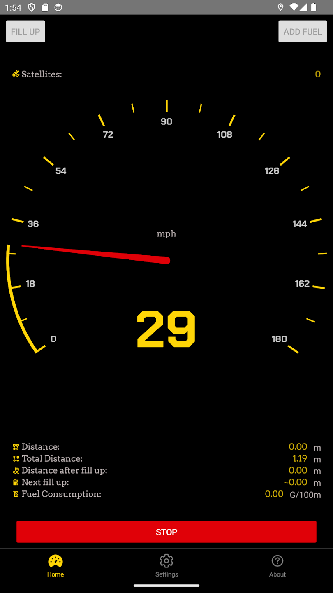
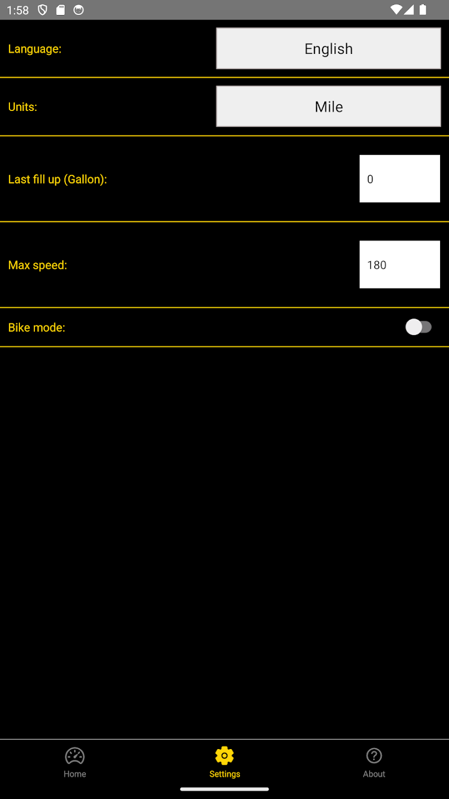
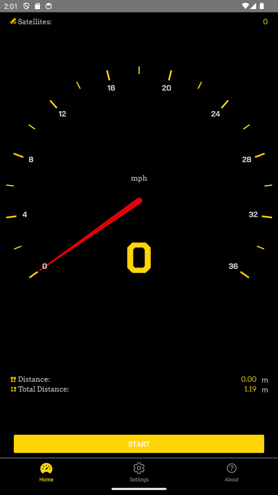

# Speedometer App Issues

We want you to like our app, and you do have the opportunity to influence the process of its improvement.

### Bug Report
If you have noticed a bug, you can [report it here](https://github.com/BorisKotlyarov/speedometer_issues/issues/new?assignees=&labels=&projects=&template=bug_report.md&title=).

### Feature Request
If you would like to suggest extending the current functionality, you can [request it here](https://github.com/BorisKotlyarov/speedometer_issues/issues/new?assignees=&labels=&projects=&template=feature_request.md&title=).

## About Speedometer App 

The speedometer uses GPS to determine speed and distance. 
Good for older cars and bicycle enthusiasts can be used as an alternative to the on-board speedometer.

Functions:
 - ✔️ shows current speed
 - 🛞 distance traveled (per session)
 - 🗺 total distance traveled (For all sessions)
 - ⛽️ fuel consumption (if customized)
 - 🚲 Bike mode (from v1.0.2)

## App installation

